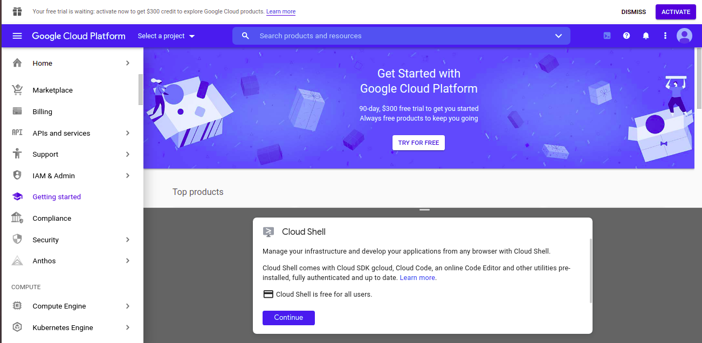
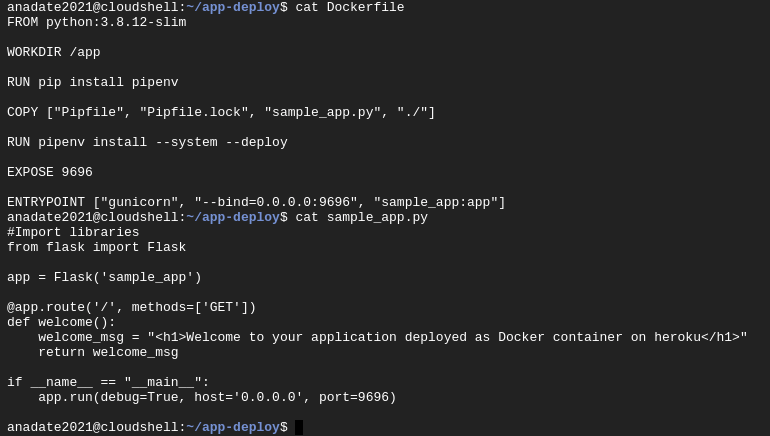
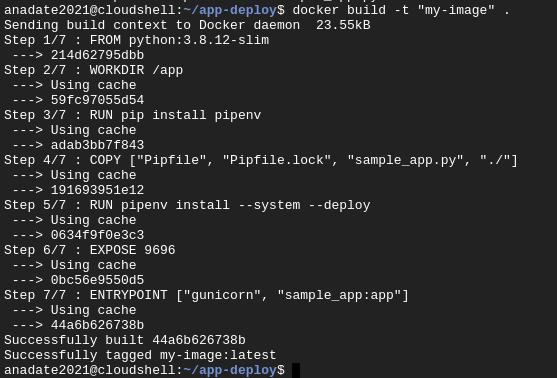
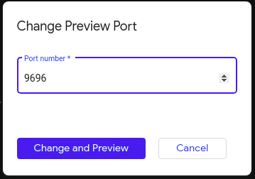

### How to use Google Cloud shell for docker containers

If you do not have docker installed on your local machine, but you want to use docker for a project for light processing, this guide may help you.

**Note:** This method is useful only for exploration/practise/testing purpose and since Google Cloud shell resets after inactivity it also deletes all docker images, containers etc. So do not use this to store critical data, but only for quick projects, temporary deployment etc.

<a id='toc'></a>
## Table of Contents
* [1. Background](#background)
* [2. Use docker in Google Cloud shell](#gcp-cloud-shell-docker)
* [3. Deploy app to docker container within Google Cloud shell](#gcp-local-container)
* [4. Deploy docker container on Heroku](#gcp-heroku-container)

----
<a id='background'></a>
[back to TOC](#toc)
### 1. Background:
In the Machine Learning Zoomcamp course conducted by Alexey Grigorev (https://github.com/alexeygrigorev/mlbookcamp-code/tree/master/course-zoomcamp) in some of the exercises and for the projects, it is required that participants deploy their application into a docker container and further deploy their application to Cloud.

However, many participants have faced issues in getting docker to work on their local machine. This guide is an attempt to help around this situation and allow use of docker without docker being installed on local machine. 

To do this, you can use Google Cloud shell, which is a free machine in Google Cloud and has docker pre-installed. Anyone having a Google account (like Gmail account) can use this method.

----
<a id='gcp-cloud-shell-docker'></a>
[back to TOC](#toc)
### 2. Use docker on Google Cloud Shell

#### 2.1 Pre-requisite

The only pre-requisite for the method suggested in this guide is to have a Gmail account.

#### 2.2 Launch Google Cloud shell

**Google Cloud console**: Launch URL https://console.cloud.google.com and login with your Google id (Gmail id). Click on the >_ icon to launch Google Clouc shell and click Continue, as shown below




**Docker in Google Cloud shell**: On the command prompt you can run any docker commands. e.g. to check all containers (there will be none initially) 

```docker ps -a```


You can now use this Docker setup to download images, build your own docker images, launch containers etc. 

---
<a id='gcp-local-container'></a>
[back to TOC](#toc)
### 3. Deploy app to docker container within Google Cloud shell

Now you can deploy your app in a docker container. Below I have explained 2 options - 1. Deploy your app as docker container within Google Cloud shell, 2. Deploy your app as docker container to Heroku. You can choose to use any of these.

Before you can deploy your app to a docker container, first prepare a folder for deployment and collect all the necessary files into the folder. I will explain with a scenario where suppose you have developed your application in let's say python on your machine, and now you want to deploy in a docker container.

**Upload files**
You can upload your application code, machine learning models, any python package dependencies management files (like requirements.txt or Pipfile and Pipefile.lock etc.) etc. from your local machine to Google Cloud shell. For this click on the 3 dots and click Upload.


Check using ```ls``` command


**Create folder for app and move files**

Now, create a directory where you will keep all the files to be deployed into the docker container, along with the Dockerfile (which has the instructions to build a container image). Them move/copy your application files and Dockerfile to this directory

```mkdir app-deploy```


Let us see how to deploy you app to a docker container and access the application. 

A sample Dockerfile and python code is shown below.



**Build docker image**
Build docker image from the Dockerfile. First change to the directory you created for deployment.

```cd app-deploy```

Now, build docker image. Below command will create a docker image with name my-image, with Dockerfile in current working directory (hence the .)

```docker build -t "my-image" .```



**Deploy docker container**
Now deploy your app as a docker container using the image that you built. Below command will launch a docker container, will delete when it is stopped (--rm flag), run it as a daemon (i.e. background process, the -d flag(, mapping port 8080 of the Cloud shell to port 9696 of container (since in Dockerfile we have exposed port 9696 of container and the gunicorn is running the app on port 9696), from image my-image.

```docker run --rm -d -p 8080:9696 my-image```

Check whether container is running

```docker ps -a```


**Access your app**
Now you can access you app. If you can interact with you app from command line you can do so as shown below from the command prompt itself

```curl localhost:8080```


If you want to access the app from your web browser, then click on the **Web preview** option and click **Preview on port 8080**. If instead of port 8080 on Cloud shell, you had mapped to a different port, then use the option **Change port** under Web Preview to change port and access you application from web browser.




That completes the procedure for deploying app in a docker container in Google Cloud shell.

---
<a id='gcp-heroku-container'></a>
[back to TOC](#toc)
### 4. Deploy docker container on Heroku

To deploy your app as docker container to Heroku, after having completed steps 1. and 2. in this guide, follow guide at this [link](./how-to-use-heroku.md)
