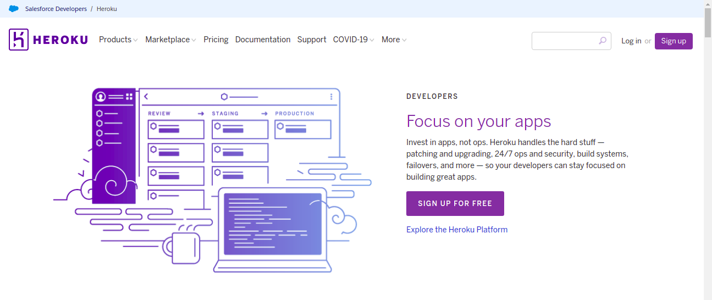
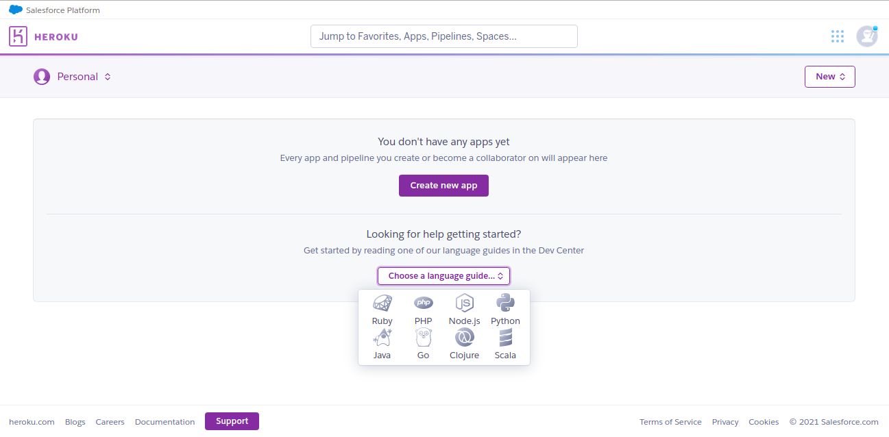
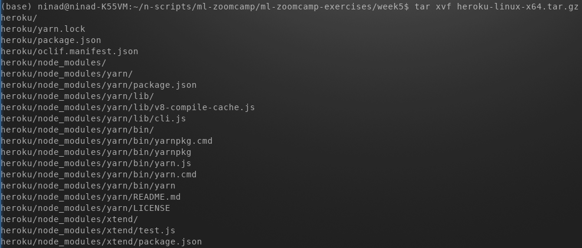

### How to use Heroku to host your python web app for free

#### Background:
In the Machine Learning Zoomcamp course conducted by Alexey Grigorev (https://github.com/alexeygrigorev/mlbookcamp-code/tree/master/course-zoomcamp) in Week/Session #5, it is required to deploy a web service which can accept user provided customer data and using a trained ML model, predict whether the customer will churn or not.

For this, participants can either deploy the web service locally on their machine, inside a docker container on their machine, or in Cloud (AWS, Azure. Google etc.).

There was one more option that was suggested, which is to use Heroku to host python based web application for free. This option will especially be useful when working on the Project 1 as part of this course, and hence I thought of exploring this option and preparing this reference for others to follow if they wish to use this option.

Following are the steps to use Heroku. These have been explained with an example web app that was used for the homework of week5 of the course.

*Thanks to Harshit for his video https://www.youtube.com/watch?v=1Z7nt0Fyits from where I learned the steps, and then some more reading from Heroku documentation.*

#### 1. Create account in Heroku

Go to https://www.heroku.com/ and Signup




You can also setup Google authenticator app on your mobile to get a token (OTP) and use it for Multi-factor authentication when logging in to Heroku.

Once logged in, you can deploy web app in any of the languages - Python, Ruby, PHP, Node.js, Java, Go, Closure, Scala



#### 2. Install Heroku command line interface (cli) on your machine

There are multiple ways to deploy a web app on Heroku (via the Heroku Dashboard, using CLI from your machine), of which I used the CLI option.

There are multiple options availabe to install Heroku cli - which can be found here - https://devcenter.heroku.com/articles/heroku-cli. I chose downloading the tarball, since it does not need any installation. 

**a. Download tarball**

To install from tarball, go to https://devcenter.heroku.com/articles/heroku-cli#tarballs and download the tarball for the Operating system of your machine. I downloaded for Ubuntu.


**b. Extract tarball**

Extract the tarball (Step fo Ubuntu shown below. For Windows simply use the WinZip or equivalent to extract/unzip from tarball).




**c. Add heroku/bin to your PATH**

To add the heroku/bin path on a Linux machine, execute the below command. For Windows refer to https://helpdeskgeek.com/windows-10/add-windows-path-environment-variable/


#### 3. Deploy your Web app to Heroku

To deploy your Web app to Heroku, you need to have all your code in one place and create a few configuration files.

**a. Prepare code base**

Create a directory for your deployment and copy your code for the Web app and any ML model files (if/as appropriate)


**b. Create configuration files**

**Specify Python version** : This is an optional step, required only if you want a specific Python version to be used in Heroku to run your web app. Check the Python version (where you have the appropriate version and where you developed/tested your code) using command ```python -V```.


Specify the version into a file named runtime.txt [Ensure everything is lower case in the file and that you mention the full version]


*Refer to https://devcenter.heroku.com/articles/python-runtimes for more details*

**Specify Python dependencies/packages** : Create requirements.txt file and specify the Python packages required for the execution of your Web app.

You could choose to use the command ```pip freeze > requirement.txt``` to populate requirements.txt based on all packages installed in your current active python environment. Or add the package names manually. I added manually.


*Note: As part of the course homework 5, scikit-learn version 1.0 is required since the model was trained using this version. Added gunicorn, to be used as the web server to run the web app in Heroku (there could be other options, for now I know of this)*

**Specify commands to be executed by the app on startup** : Heroku apps include a Procfile that specifies the commands that are executed by the app on startup.

The command for this example would be as below. 

web: gunicorn <name of your python script without the .py>:<instance name of Flask>

* web: indicates that the web server process can receive external HTTP traffic from Heroku’s routers.
* gunicorn is the web server (software) that will be used
* app is the instance name of Flask when you define something like **app** = Flask(somename_foryourapp)

e.g. I used ```web: gunicorn w5-hw-svc-predict:app``` since my python file name is w5-hw-svc-predict.py and I have defined Flask instance as ```app = Flask('churn')```
  

  
*Find more info on Procfile *
  
**c. Deploy web app to Heroku**

Heroku supports multiple methods for deployment - Git (GitHub, Heroku Git), Docker container image, Integrations. So far, I have explored the Git method using Heroku git.
  
*Assuming you have git installed on your machine. If not install it. (On Ubuntu using ```sudo apt install -y git```)*
  
**Initialize local git repository** : After having collected your code and defined necessary configurations files, initialize local git repository
  
```git init```
  
Add all the contents of the directory to git repo
  
```git add .```
  
Commit changes to local git repo
  
```git commit -m "some commit message"
  


**Login to heroku** : Using heroku cli, login to heroku [In step 2.c. above the path has already been set]. Verify heroku command is found in the path then login. Press any key when asked to do so.


  
This will open a tab in your web browser asking you to login to Heroku. Login to Heroku.


Now you can close this tab and return to the command prompt on your terminal
  

  
**Create an application** : You need to create a new application in Heroku before deploying the code to it. Create an application
  

  
This creates an application and also a Heroku git repo for this application. You can go to the Heroku dashboard to see the application being created with a default web page.
  

  


**Push code and configurations to Heroku git for deployment** : You can now push to remote git (Heroku git). Once the contents are pushed to Heroku git, it automatically triggers the deployment.
  

  


#### 4. Test your Web App  

You can now test whether your Web App is running successfully (now being hosted on Heroku). From your local machine (or from anywhere, where you have python installed, requests package installed and having internet access) execute the code to test your Web App.

Below is sample test scenario for the homework of Week5 of ML Zoomcamp course.
  

