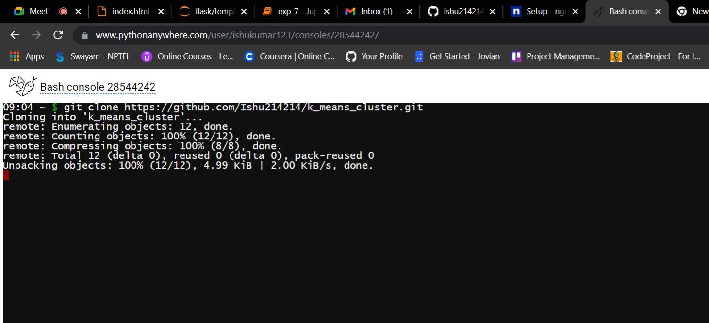

#### 1. Signup
  Step 1 : login in python anywhere
  
  
**a.** Go to PythonAnywhere website at https://www.pythonanywhere.com/ and click on **Pricing & signup**.


**b.** Click **Create a Beginner account** , then provide your details to get your account created.


**c.** You will see a Warning to confirm you email. Confirm your email, login again and the Warning disappears.

You will see the PythonAnywhere Dashboard giving you a summary.


#### 2. Prepare the environment
To open the Bash console, on the Dashboard page under Consoles, under New console click **$ Bash**. This will open the bash console on the underlying linux machine.
 
 
 
 Step 2 :
Click on Recent Consoles


Uploading your code to PythonAnywhere
Assuming your code is already on a code sharing site like GitHub or Bitbucket, you can just clone it from a Bash Console:


 
STEP 3:

To open the Bash console, on the Dashboard page under Consoles, under New console click **$ Bash**. This will open the bash console on the underlying linux machine.
   


STEP 4:
Copy your GitHub file


STEP 5:
Write on bash git clone and past your GitHub file location


# for example
$ git clone https://github.com/myusername/myproject.git

**a.** Many of the popular python libraries are pre-installed. You can check that by opening the Bash console.
**b.** Type the command ```pip list``` to see the pre-installed python packages and their versions.
   

or 

   
STEP 6:
Go to Files section

    

#### 3. Create/Deploy your Web App
 
**a.** Now you can create your Webapp (The free account allows deploying a single webapp). Click on **Web**, then click **+ Add a new web app**


    

    
**b.** Select **Flask**
    

    
**c.** Then, select **Python 3.8**
    

    
**d.** You can now accept the default path and filename for the python code for flask app (I chose default), or you can provide details as per your preference.
    


You need to change path

Go to Code section and click on Source codes and rename (mysite to your GitHub file)


NOW go to WSGI configuration file 
Write flask_app to app


Write in project_home to your GitHub file name

**e.** Your web app is now deployed and active (with a default code). For the free account, to keep your web app active, you need to click the **Run until 3 months from today** atleast once before the 3 months expire.
   
Make a note of the URL for your web app (this is typically https://yourid.pythonanywhere.com)
    

    
**f.** Test the sample web app (with the default code). Open a tab in your browser and paste your web app URL
   

   


